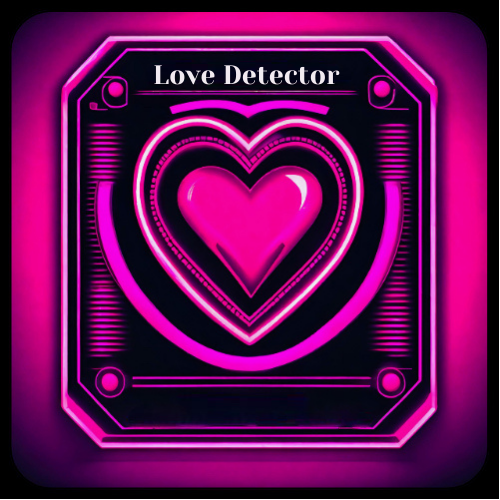
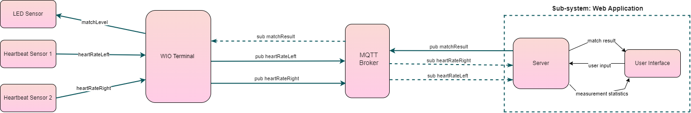

# Love Detector: The New Speed-Dating Tool
### Table of Contents
- [Table of Contents](#table-of-contents)
- [Project Description](#project-description)
- [Purpose](#purpose)
- [Benefits](#benefits)
- [Dependencies](#dependecies)
- [System Sensors](#system-sensors)
- [Installation](#installation)
  1. [Installation: Wio Seeed Terminal](#installation-wio-seeed-terminal)
  2. [Installation: Web-Based UI](#installation-web-based-ui)
- [Usage](#usage)
  1. [Usage: Wio Seeed Terminal](#usage-wio-seeed-terminal)
  2. [Usage: Web-Based UI](#usage-web-based-ui)
  3. [Demo and Examples](#demo-and-examples)
- [Hardware and Software Diagrams](#hardware-and-software-diagrams)  
- [Documentation](#documentation)
- [License](#license)
- [Team Members and Contributions](#team-members)

## Project Description:
***The Love Detector*** is an all-in-one integrated system that provides a new and fun approach to the speed-date experience. 
The system measures your heartbeat as you engage in conversation with your potential match and suggests whether there seems to be a spark. 
Through the use of ***Heart Rate Sensors*** information is conveyed from the ***Wio Seeed Terminal*** to a ***Web-Based User Interface***. 
After careful analyzation, results are calculated based on a pre-established [***Love Detection Algorithm***](https://git.chalmers.se/courses/dit113/2024/group-4/love-detector/-/wikis/Love-Detector-Algorithm).

## Purpose:
The purpose of our project, ***The Love Detector*** is to create a scientifically driven, analytical tool that assesses the likelyhood of a deeper connection or a so-called **"spark"** between two individuals during a speed-date. By combining continious *heartbeat detection*, a rotating *list of questions*, and a special *algorithm*, the project relies on the *physical reactions* our body exerts in moments of excitement, 
to achieve the best possible *deduction*. 

## Benefits:
***The Love Detector*** offers significant benefits in enhancing connections during speed-dates. By utilizing scientifically driven analysis of physiological responses such as **BPM**, coupled with thought-provoking questions, ***The Love Detector*** provides a unique insight into the compatibility between people during these brief interactions. This technology-driven approach not only facilitates genuine and engaging conversations based on participants' shared interests but also introduces a novel way to uncover potential connections. As a result, ***The Love Detector*** helps foster **meaningful and authentic connections** during the fast-paced setting of speed-dates and our lives in general. 

## Dependencies: 
The following section lists the dependencies and requirements for the project. These should be installed prior to the 
installation process described in the next section:
 1. [Wio Seeed Terminal](https://www.seeedstudio.com/Wio-Terminal-p-4509.html) (or a compatible alternative board)

 2. [Arduino IDE](https://www.arduino.cc/en/software) or [Arduino CLI](https://github.com/arduino/arduino-cli)

 3. **Wio Terminal Board Library**: follow the installation tutorial [here](https://wiki.seeedstudio.com/Wio-Terminal-Getting-Started/#getting-started)

 4. All of the following libraries need to be installed in the **Arduino IDE**:
   - *TFT_eSPI* - [link](https://github.com/Bodmer/TFT_eSPI)
   - *rpcWifi* - [link](https://github.com/Seeed-Studio/Seeed_Arduino_rpcWiFi)
   - *Arduino MQTT Client* - [link](https://github.com/arduino-libraries/ArduinoMqttClient)
   - *Adafruit_NeoPixel* - [link](https://github.com/adafruit/Adafruit_NeoPixel)

 5. The needed Grove Sensors for the project can be found [here](#system-sensors)

 6. [Git](https://git-scm.com/downloads) should be installed and working on your machine so the repository of the project can be cloned.

 7. [Node.js](https://nodejs.org/en) and [npm](https://www.npmjs.com/) should be installed.
   - *Note:* **Node.js** comes standardly with **npm** as a package, so you most likely don't need to download it separetely.
   - *Note:* We strongly recommend that you go with the **latest stable version** of **Node.js** 

## System Sensors:
The following list contains the sensors used in this project:
+ Grove - [RGB LED Stick (10 – WS2813 Mini)](https://wiki.seeedstudio.com/Grove-RGB_LED_Stick-10-WS2813_Mini/) 
+ Grove - [Ear-clip Heart Rate Sensor](https://wiki.seeedstudio.com/Grove-Ear-clip_Heart_Rate_Sensor/) Note: two(2) of these sensors are needed.
  
## Installation:
The following section lists the needed steps in order to complete the installation process for the project:

  ### *Installation: Wio Seeed Terminal*
  1. Ensure that all libraries are installed by following these steps:
    - Open *Arduino IDE*, go to *Tools -> Manage Libraries* .
    - From the list of [*Dependecies*](#dependencies), under *Section 4*, search the name of the library and click *Install*.
    - Repeat this for all libraries listed.(It is best to install the latest versions of the libraries).

---

  ### *Installation: Web Application*
  1. Ensure you have *Node.js* and *npm* installed. If not, download and install them from [here](https://nodejs.org/en/).
  2. Navigate to the directory of the project in in your *terminal*.
  3. Run *npm install* in your *terminal* to install all the required dependencies listed in the [package.json](src/Web/package.json) file.

## Usage:
The following section presents a short guide on how to use our project: 
***Note:*** Make sure you have completed the [*Installation*](#installation) guides to be able to use the project.

  ### *Usage: Wio Seeed Terminal*
  1. Connect the *Wio Seeed Terminal* using a USB-C cable to your machine.
  2. Open *Arduino IDE* and navigate to *File -> Open*.
  3. Go to the project folder and open *Wio* Folder (with path: love-detector/src/Wio).
  4. Navigate to *Select Board* and make sure the *Wio Seeed Terminal* is selected.
  5. Locate the *love_detector.ino* file and run it by using the *Upload* button.

---

  ### *Usage: Web Application*
  1. In your *Terminal* navigate to the *Web* folder (with path: love-detector/src/Web).
  2. Run *npm start* in the terminal.
  3. Open your browser and enter the address *localhost:$$$$*. Replace *$$$$* with the port number in the terminal.
  4. To stop the application, press *CTRL + C* in the terminal.    

---

  ## *Demo and Examples*
  In order to create a full demonstration of how the project works, the team has created a video.
  This video is based on an example [scenario](https://git.chalmers.se/courses/dit113/2024/group-4/love-detector/-/wikis/home). To view the video, click [here]().

## Hardware and Software Diagrams:
The following section contains the design diagram, that the team followed during the lifecycle of the project:

## Full Documentation:
For the full documentation of the project, see our [Wiki](https://git.chalmers.se/courses/dit113/2024/group-4/love-detector/-/wikis/home).
You can navigate between the different pages, using the panel on the right side.

## License:
The project is licensed under the MIT License. Refer to the [**LICENSE**](documents/License) file for more information.

## Team Members and Contributions:
- Georgi Penchev (penchev@student.chalmers.se): Main contributions made in the Back-End with the Wio terminal, including taking the lead on computing the heartbeat sensors as well as assisting team members with other parts of hardware-related programming such as LED lights and communication from Wio terminal to broker.
- Kristina Trampush (gustramkr@student.gu.se): Main contributions made in the Front-End, including taking the lead on development of the Web application, including communication between server and UI as well as UI design.
- Pavlo Ovchynnykov (gusovchpa@student.gu.se): Main contributions made in MQTT connectivity as well as the Back-End with the Wio terminal, including continuously handling new connections between the different components of the system as well as computing the heartbeat sensors.  
- René Ignacio González Pérez (renei@student.chalmers.se): Main contributions made in the Web application with a special focus on computing the compatibility algorithm, as well as contributing to the UI design and computing of LED lights in the Wio terminal.
- Telina Hjärtberg (telina.hjartberg@icloud.com): Main contributions made in the Web application with a focus on UI design, as well as computing the LED lights in the Wio terminal.

*Love Detector 2024*, **DIT113, University of Gothenburg | Chalmers University of Technology, Sweden**  