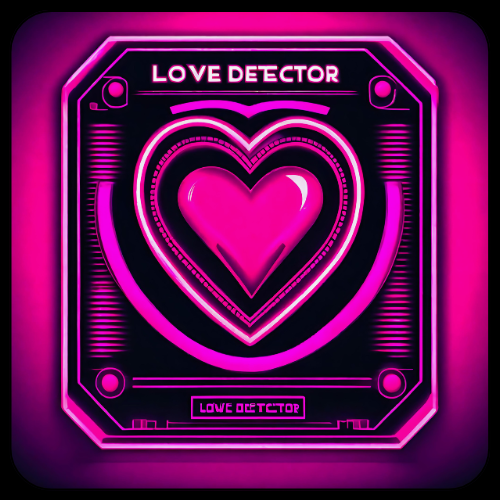
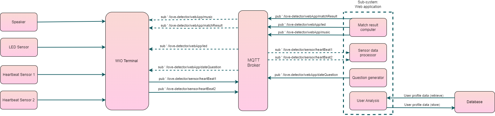

# Love Detector

### Table of Contents
- [Love Detector](#love-detector)
    - [Table of Contents](#table-of-contents)
- [Project Description](#project-description)
- [Purpose](#purpose)
- [Benefits](#benefits)
- [Dependencies](#dependecies)
- [System Sensors](#system-sensors)
- [Installation](#installation)
- [Hardware and Software Diagrams](#hardware-and-software-diagrams)  
- [Documentation](#documentation)
- [License](#license)
    - [Team members](#team-members)

## Project Description:
***The Love Detector*** is an all-in-one integrated system that provides a new and fun approach to the speed-date experience. 
The system measures your heartbeat as you engage in conversation with your potential match and suggests whether there seems to be a spark. 
Through the use of **sensors** information is conveyed from the ***Wio Seeed Terminal*** to a web-based user interface that displays the information.

## Purpose:
The purpose of our project, ***The Love Detector*** is to create a scientifically driven analytical tool that assesses the likelihoos of a romantic connection or "spark" between two individuals during a speed date. By combining heatbeat, a rotating lis tof questions, and an algorith the project aims to find connection based on uncontrollable reactions from the body.

## Benefits:
***The Love Detector*** offers significant benefits in enhancing connections during speed dates.By utilizing scientifically driven analysis of physiological responses such as bpm, coupled with a thought provoking questions, the Love Detector provides a unique insight into the compatibility between people during these brief interactions. This technology-driven approach not only facilitates genuine and engaging conversations based on participants' shared interests but also introduces a novel way to uncover potential connections based on uncontrollable reactions from the body. As a result, the Love Detector help foster meaningful and authentic connections during the fast paced setting of speed dates.

## Dependencies: 
The following section lists the dependencies and requirements for the project. These should be installed prior to the 
installation process described in the next section:
 1. [Wio Seeed Terminal](https://www.seeedstudio.com/Wio-Terminal-p-4509.html) (or a compatible alternative board)
 2. [Arduino IDE](https://www.arduino.cc/en/software) or [Arduino CLI](https://github.com/arduino/arduino-cli)
 3. Wio Terminal Board Library: follow the installation tutorial [here](https://wiki.seeedstudio.com/Wio-Terminal-Getting-Started/#getting-started)
 4. All of the following libraries need to be installed in your Arduino:
 5. The needed Grove Sensors for the project can be found [here](#system-sensors)
 6. [Node.js](https://nodejs.org/en) and **npm** (the Node Package Manager) for the web-based application (it is required to go with the latest stable version of **Node.js**)
     * **Node.js** comes pre-packaged with **npm**, so there's no need to install npm separately.
     * All the required dependencies for the web-based application are listed in the [package.json](src/Web/package.json) file and no additional packages and/or global dependencies are required to be installed.
 7. [Git](https://git-scm.com/downloads) should be installed and working on your machine so the repository of the project can be cloned.

## System Sensors:
In no particular order the sensors used in this project(as per the initial scope are the following):
+ Grove - [RGB LED Stick (10 – WS2813 Mini)](https://wiki.seeedstudio.com/Grove-RGB_LED_Stick-10-WS2813_Mini/) 
+ Grove - [Ear-clip Heart Rate Sensor](https://wiki.seeedstudio.com/Grove-Ear-clip_Heart_Rate_Sensor/) Note: two(2) of these sensors are needed.
+ Grove - [Speaker](https://wiki.seeedstudio.com/Grove-Speaker/)
+ Grove - [Grove LED Bar v2.0](https://wiki.seeedstudio.com/Grove-LED_Bar/)

## Installation:

## Hardware and Software Diagrams:
This is the design diagram that the team followed during the lifecycle of the project:

## Documentation

## License
The project is licensed under the MIT License. Refer to the [**LICENSE**](LICENSE) file for more information.

### Team members:
-Georgi Penchev (penchev@student.chalmers.se)
-Kristina Trampush (enter email here)
-Pavlo Ovchynnykov (enter email here)
-René Ignacio González Pérez (renei@student.chalmers.se)
-Telina Hjärtberg (enter email here)